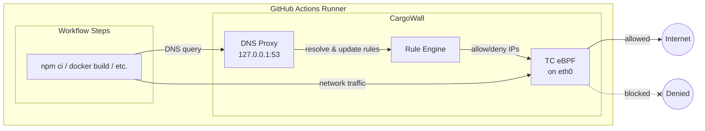

# CargoWall GitHub Action

Secure your GitHub Actions workflows with eBPF-based network egress filtering. CargoWall uses Linux Traffic Control (TC) eBPF programs to filter outbound network connections, preventing supply chain attacks and data exfiltration.

## Features

- **eBPF-based filtering**: Uses kernel-level filtering for high performance and reliability
- **Hostname filtering**: Allow/deny based on domain names
  - Subdomains are automatically allowed (i.e. `github.com` would also allow `api.github.com`)
- **CIDR filtering**: Allow/deny based on IP address ranges
- **DNS tunneling prevention**: Blocks DNS queries for non-allowed domains
- **Docker support**: Automatically configures Docker containers to respect firewall rules
- **Sudo lockdown**: Optionally restrict sudo access to prevent firewall bypass
- **Graceful degradation**: Warns and continues if eBPF is unavailable

## Quick Start

```yaml
- uses: code-cargo/cargowall@v1
  with:
    default-action: deny
    allowed-hosts: |
      github.com,
      githubusercontent.com,
      registry.npmjs.org
```

## Usage

### Basic Example

```yaml
name: Secure Build

on: [push, pull_request]

jobs:
  build:
    runs-on: ubuntu-latest
    steps:
      - uses: actions/checkout@v4

      - uses: code-cargo/cargowall@v1
        with:
          default-action: deny
          allowed-hosts: |
            github.com,
            githubusercontent.com,
            api.github.com,
            registry.npmjs.org

      - run: npm ci
      - run: npm run build
      - run: npm test
```

### With Docker Support

CargoWall automatically configures Docker to use its DNS proxy, so hostname filtering works inside containers:

```yaml
- uses: code-cargo/cargowall@v1
  with:
    default-action: deny
    allowed-hosts: |
      docker.io,
      docker.com,
      registry.npmjs.org

- name: Build Docker image
  run: docker build -t myapp .
```

### Audit Mode

Run in audit mode to log connections without blocking them — useful for understanding your workflow's network dependencies before enforcing rules:

```yaml
- uses: code-cargo/cargowall@v1
  with:
    mode: audit
    default-action: deny
    allowed-hosts: |
      github.com,
      githubusercontent.com
```

### With Sudo Lockdown (Maximum Security)

Enable sudo lockdown to prevent subsequent steps from disabling the firewall:

```yaml
- uses: code-cargo/cargowall@v1
  with:
    default-action: deny
    allowed-hosts: |
      github.com,
      archive.ubuntu.com
    sudo-lockdown: true
    sudo-allow-commands: /usr/bin/apt-get,/usr/bin/docker
```

### With Config File

For complex configurations, use a JSON config file:

```yaml
- uses: code-cargo/cargowall@v1
  with:
    config-file: .github/cargowall.json
```

**`.github/cargowall.json`**:
```json
{
  "defaultAction": "deny",
  "rules": [
    { "type": "hostname", "value": "github.com", "action": "allow" },
    { "type": "hostname", "value": "registry.npmjs.org", "action": "allow" },
    { "type": "cidr", "value": "10.0.0.0/8", "ports": [443, 80], "action": "allow" }
  ]
}
```

## Inputs

| Input                        | Description                                                          | Default      |
|------------------------------|----------------------------------------------------------------------|--------------|
| `mode`                       | Enforcement mode: `enforce` (block) or `audit` (log only)           | `enforce`    |
| `default-action`             | Default action for unmatched traffic (`allow` or `deny`)             | `deny`       |
| `allowed-hosts`              | Comma-separated allowed hostnames (supports wildcards)               |              |
| `allowed-cidrs`              | Comma-separated allowed CIDR blocks                                  |              |
| `blocked-hosts`              | Comma-separated blocked hostnames                                    |              |
| `blocked-cidrs`              | Comma-separated blocked CIDR blocks                                  |              |
| `config-file`                | Path to JSON config file for advanced rules                          |              |
| `version`                    | CargoWall version to use                                             | `latest`     |
| `fail-on-unsupported`        | Fail if eBPF not supported                                          | `false`      |
| `sudo-lockdown`              | Enable sudo lockdown to prevent firewall bypass                      | `false`      |
| `sudo-allow-commands`        | Comma-separated command paths to allow via sudo when locked          |              |
| `dns-upstream`               | Upstream DNS server (auto-detected if not set)                       | auto-detect  |
| `allow-existing-connections` | Allow pre-existing TCP connections at startup                        | `true`       |
| `binary-path`                | Path to a pre-built cargowall binary (skips download)                |              |
| `debug`                      | Enable debug logging                                                 | `false`      |
| `audit-summary`              | Generate audit summary in workflow summary                           | `true`       |
| `github-token`               | GitHub token for step correlation in audit summary                   | `${{ github.token }}` |

## Outputs

| Output      | Description                                      |
|-------------|--------------------------------------------------|
| `supported` | Whether eBPF firewall was successfully activated |
| `pid`       | Process ID of the running cargowall instance     |

## How It Works

1. **DNS Interception**: CargoWall runs a DNS proxy that intercepts all DNS queries
2. **JIT Rule Updates**: When a hostname is resolved, the resulting IPs are dynamically added to the firewall
3. **eBPF Filtering**: A TC (Traffic Control) eBPF program filters egress traffic based on destination IP and port
4. **Docker Integration**: Docker daemon is configured to use CargoWall's DNS proxy



## Security Model

### What Gets Blocked

- **Direct IP connections**: Unless the IP is in an allowed CIDR
- **Hostname connections**: Unless the hostname matches an allowed pattern
- **DNS tunneling**: Queries for non-allowed domains are refused at the proxy

### What Gets Allowed

- Traffic to explicitly allowed hostnames and CIDR ranges
- Pre-existing TCP connections established before CargoWall starts (when `allow-existing-connections: true`, the default)

#### Automatically Allowed Traffic

CargoWall automatically allows certain traffic required for the runner and GitHub Actions to function:

| Traffic | Ports | Why |
|---------|-------|-----|
| Localhost (127.0.0.0/8, ::1) | All | Internal communication |
| Link-local (169.254.0.0/16, fe80::/10) | All | Network infrastructure |
| Azure IMDS (169.254.169.254) | All | Instance metadata on GitHub-hosted runners |
| DNS upstream server | 53 | Required for DNS resolution |
| systemd-resolved upstreams | All | Runner DNS infrastructure |
| Docker bridge IP | 53 | DNS for containers |
| `actions.githubusercontent.com` | All | GitHub Actions artifact/cache services |
| `ACTIONS_RUNTIME_URL` host | All | GitHub Actions runtime |
| `ACTIONS_RESULTS_URL` host | All | GitHub Actions results |
| `ACTIONS_CACHE_URL` host | All | GitHub Actions cache |
| IPv6 multicast (ff00::/8) | All | Neighbor discovery, required for IPv6 |
| ICMPv6 | All | IPv6 neighbor discovery protocol |

### Sudo Lockdown

When `sudo-lockdown: true`, sudo is restricted so that subsequent workflow steps cannot disable the firewall. You control which commands are still allowed via `sudo-allow-commands`:

```yaml
sudo-lockdown: true
sudo-allow-commands: /usr/bin/apt-get,/usr/bin/docker
```

With this configuration, `sudo apt-get install ...` and `sudo docker build ...` will work, but attempts to run `sudo iptables -F`, `sudo pkill cargowall`, or `sudo vim /etc/resolv.conf` will be blocked.

Sudo lockdown also removes the current user from the `docker` group. This is because Docker group membership grants the ability to run containers with root-level access, which could be used to bypass the firewall.

## Runner Compatibility

| Runner Type                   | eBPF Support | Notes                            |
|-------------------------------|--------------|----------------------------------|
| GitHub-hosted (ubuntu-latest) | Yes          | Full support with sudo           |
| GitHub-hosted (ubuntu-22.04)  | Yes          | Full support with sudo           |
| GitHub-hosted (ubuntu-24.04)  | Yes          | Full support with sudo           |
| Self-hosted Linux             | Yes          | Requires kernel 5.x+ and CAP_BPF |
| GitHub-hosted macOS           | No           | macOS doesn't support eBPF       |
| GitHub-hosted Windows         | No           | Windows doesn't support eBPF     |

## Troubleshooting

### eBPF not supported

If you see warnings about eBPF not being supported:

1. Ensure you're using a Linux runner (`ubuntu-latest`)
2. The action runs with `sudo` which is required for eBPF
3. Check kernel version with `uname -r` (need 5.x+)

### DNS resolution fails

If DNS queries are timing out:

1. Check that `dns-upstream` is reachable
2. Verify the allowed hosts include your required domains
3. Enable `debug: true` to see detailed logs

### Docker containers can't reach allowed hosts

1. Ensure Docker is running before the action
2. CargoWall automatically configures Docker DNS
3. Check `/etc/docker/daemon.json` was updated

## License

Apache 2.0 - See [LICENSE](LICENSE) for details.

## Contributing

This action is part of the [CodeCargo](https://github.com/code-cargo) project. Issues and PRs welcome!
