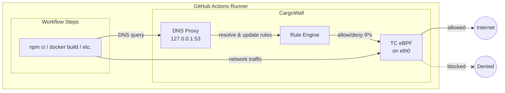

# CargoWall GitHub Action
[](https://github.com/code-cargo/cargowall-action/actions/workflows/test.yml)
[](https://github.com/code-cargo/cargowall-action/actions/workflows/check-dist.yml)
[](LICENSE)
[](https://github.com/code-cargo/cargowall-action/releases)

The official GitHub Action for [CargoWall](https://github.com/code-cargo/cargowall) — an eBPF-based network firewall for GitHub Actions runners that monitors and controls outbound connections during CI/CD runs.

Secure your GitHub Actions workflows with eBPF-based network egress filtering. Prevent supply chain attacks, block data exfiltration, and control outbound connections at the kernel level.

For concepts, architecture, and platform capabilities, see the [main CargoWall repository](https://github.com/code-cargo/cargowall).

## Features

- **eBPF-based filtering**: Uses kernel-level filtering for high performance and reliability
- **Hostname filtering**: Allow/deny based on domain names
  - Subdomains are automatically allowed (i.e. `example.com` would also allow `api.example.com`), with `*`/`**` wildcards when you need tighter control — see [How Hostnames Match](#how-hostnames-match)
  - CNAME chains of allowed hosts are followed transparently — if an allowed host resolves through a moving CDN edge, the chain's target names and IPs are allowed automatically, so you don't have to wildcard churning CDN targets
- **CIDR filtering**: Allow/deny based on IP address ranges
- **DNS tunneling prevention**: Blocks DNS queries for non-allowed domains
- **Docker support**: Automatically configures Docker containers to respect firewall rules
- **Sudo lockdown**: Optionally restrict sudo access to prevent firewall bypass
- **Graceful degradation**: Warns and continues if eBPF is unavailable

## Quick Start

List only the hosts your build needs. GitHub and Actions hosts are already allowed on port 443 — see [Automatically Allowed Traffic](#automatically-allowed-traffic).

```yaml
- uses: code-cargo/cargowall-action@v1
  with:
    allowed-hosts: |
      registry.npmjs.org
```

Everything else is denied by default.

## Usage

### Basic Example

```yaml
name: Secure Build

on: [push, pull_request]

jobs:
  build:
    runs-on: ubuntu-latest
    permissions:
      contents: read
      actions: read
      id-token: write
    steps:
      - uses: actions/checkout@v4

      - uses: code-cargo/cargowall-action@v1
        with:
          allowed-hosts: |
            registry.npmjs.org

      - run: npm ci
      - run: npm run build
      - run: npm test
```

> **Note:** The action connects to the [CodeCargo platform](https://www.codecargo.com) by default. For full integration, your job needs these permissions: `id-token: write` (OIDC authentication), `actions: read` (correlate network events to steps), and `contents: read`. If `id-token: write` is not granted, the action will warn and continue without API integration. Set `offline: true` to skip API communication entirely.

### How Hostnames Match

A plain hostname also matches its subdomains, at any depth:

- `example.com` matches `example.com`, `api.example.com`, and `a.b.example.com`

A hostname containing a wildcard matches **only** what the pattern says — it gets no automatic subdomain matching. `*` matches exactly one DNS label, `**` matches one or more:

- `*.example.com` matches `api.example.com`, but **not** `example.com` or `a.b.example.com`
- `**.example.com` matches `api.example.com` and `a.b.example.com`, but **not** `example.com`

These are two different mechanisms, so the plain form is the broader one: `example.com` allows the apex *and* every subdomain, while `*.example.com` excludes the apex. Reach for a wildcard when you want to *exclude* the apex or pin the depth — not as a way to "add" subdomains.

```yaml
- uses: code-cargo/cargowall-action@v1
  with:
    allowed-hosts: |
      *.github.com
      **.ubuntu.com
      registry.npmjs.org
```

### Restricting Ports

An `allowed-hosts` entry allows **all ports** by default. Append `:port` to scope it, and separate multiple ports with `;`:

```yaml
- uses: code-cargo/cargowall-action@v1
  with:
    allowed-hosts: |
      registry.npmjs.org:443
      internal.example.com:443;80
```

The [automatically allowed](#automatically-allowed-traffic) GitHub and Azure service hostnames are always scoped to port 443. This is why adding `github.com` to `allowed-hosts` is not a no-op: it is *broader* than the built-in rule, opening every port rather than just 443.

### With DNS Search Domains

Cloud runners resolve internal hosts through a DNS search domain. A search-domain suffix is stripped before rule matching, and any name ending in one passes the DNS proxy even without a matching hostname rule — useful when the underlying traffic is already governed by a CIDR rule and per-hostname tracking would be wasteful.

**The suffixes for the detected cloud provider are added automatically** — you do not need to configure these:

| Detected environment                | Suffixes added automatically                                         |
|-------------------------------------|----------------------------------------------------------------------|
| AWS                                 | `.compute.internal`, `.ec2.internal`                                 |
| Azure (incl. GitHub-hosted runners) | `.internal.cloudapp.net`                                             |
| GCP                                 | `.google.internal`                                                   |
| Kubernetes (always)                 | `.cluster.local`, `.svc.cluster.local`, `.default.svc.cluster.local` |

Use `search-domains` for suffixes that auto-detection does not cover — a self-hosted runner, a custom internal zone, or GCP's `.c.PROJECT_ID.internal` (omitted above because it requires a metadata lookup):

```yaml
- uses: code-cargo/cargowall-action@v1
  with:
    allowed-cidrs: |
      10.0.0.0/8
    search-domains: |
      .internal.corp.example.com
```

With this configuration:
- A rule for `bastion` also matches `bastion.internal.corp.example.com` (the suffix is stripped before matching).
- Any name ending in a configured suffix passes the DNS proxy even without a matching hostname rule, while explicit deny rules still win.

Each suffix must have at least two labels (`.compute.internal` is valid, `.internal` is not) and cannot be a public suffix (`.com`, `.co.uk`, `.github.io`, … are rejected).

### With Docker Support

CargoWall automatically configures Docker to use its DNS proxy, so hostname filtering works inside containers:

```yaml
- uses: code-cargo/cargowall-action@v1
  with:
    allowed-hosts: |
      docker.io
      docker.com
      registry.npmjs.org

- name: Build Docker image
  run: docker build -t myapp .
```

### Audit Mode

Run in audit mode to log connections without blocking them — useful for understanding your workflow's network dependencies before enforcing rules:

```yaml
- uses: code-cargo/cargowall-action@v1
  with:
    mode: audit
```

### With Sudo Lockdown (Maximum Security)

Enable sudo lockdown to prevent subsequent steps from disabling the firewall:

```yaml
- uses: code-cargo/cargowall-action@v1
  with:
    allowed-hosts: |
      archive.ubuntu.com
    sudo-lockdown: true
    sudo-allow-commands: |
      /usr/bin/apt-get
      /usr/bin/docker
```

### With Config File

For complex configurations, use a JSON or YAML config file:

```yaml
- uses: code-cargo/cargowall-action@v1
  with:
    config-file: .github/cargowall.json
```

**`.github/cargowall.json`**:
```json
{
  "rules": [
    { "type": "hostname", "value": "github.com", "action": "allow" },
    { "type": "hostname", "value": "registry.npmjs.org", "action": "allow" },
    { "type": "cidr", "value": "10.0.0.0/8", "ports": [443, 80], "action": "allow" }
  ]
}
```

## Inputs

| Input                        | Description                                                                                                                                                                                                                                                                            | Default                                        |
|------------------------------|----------------------------------------------------------------------------------------------------------------------------------------------------------------------------------------------------------------------------------------------------------------------------------------|------------------------------------------------|
| `mode`                       | Enforcement mode: `enforce` (block) or `audit` (log only)                                                                                                                                                                                                                              | `enforce`                                      |
| `allowed-hosts`              | Allowed hostnames, one per line. Matches subdomains, supports `*`/`**` wildcards, and allows all ports unless you append `:443`. See [How Hostnames Match](#how-hostnames-match)                                                                                                       |                                                |
| `allowed-cidrs`              | Allowed CIDR blocks, one per line                                                                                                                                                                                                                                                      |                                                |
| `search-domains`             | Extra DNS search-domain suffixes, one per line — stripped before hostname-rule matching and bypassed for unmatched DNS queries. The detected cloud provider's suffixes are added [automatically](#with-dns-search-domains). Each suffix needs ≥2 labels and cannot be a public suffix. |                                                |
| `github-service-hosts`       | GitHub service hostnames to auto-allow on port 443 (one per line). Replaces the default list rather than adding to it; an empty value is an error                                                                                                                                      | See [defaults](#automatically-allowed-traffic) |
| `azure-infra-hosts`          | Azure infrastructure hostnames to auto-allow on port 443 (one per line), applied only on Azure. Replaces the default list rather than adding to it; an empty value is an error                                                                                                         | See [defaults](#automatically-allowed-traffic) |
| `config-file`                | Path to YAML/JSON config file for advanced rules                                                                                                                                                                                                                                       |                                                |
| `fail-on-unsupported`        | Fail if eBPF not supported                                                                                                                                                                                                                                                             | `false`                                        |
| `sudo-lockdown`              | Enable sudo lockdown to prevent firewall bypass                                                                                                                                                                                                                                        | `false`                                        |
| `sudo-allow-commands`        | Command paths to allow via sudo when locked, one per line                                                                                                                                                                                                                              |                                                |
| `dns-upstream`               | Upstream DNS server (auto-detected if not set)                                                                                                                                                                                                                                         | auto-detect                                    |
| `allow-existing-connections` | Allow pre-existing TCP connections at startup                                                                                                                                                                                                                                          | `true`                                         |
| `binary-path`                | Path to a pre-built cargowall binary (skips download)                                                                                                                                                                                                                                  |                                                |
| `debug`                      | Enable debug logging                                                                                                                                                                                                                                                                   | `false`                                        |
| `audit-summary`              | Generate audit summary in workflow summary                                                                                                                                                                                                                                             | `true`                                         |
| `skip-actions-api`           | Skip the GitHub Actions API call that enriches audit-summary step names/status (falls back to local `_diag` data); set `true` when near the per-repo rate limit                                                                                                                        | `false`                                        |
| `github-token`               | GitHub token for fetching step timing in the audit summary                                                                                                                                                                                                                             | `${{ github.token }}`                          |
| `api-url`                    | CodeCargo API URL for audit upload and policy fetch (policy requires GitHub App)                                                                                                                                                                                                       | `https://app.codecargo.com`                    |
| `offline`                    | Skip all CodeCargo API communication (audit upload and policy fetch)                                                                                                                                                                                                                   | `false`                                        |
| `job-id`                     | Check run ID of the current job (from workflow context by default; override if needed)                                                                                                                                                                                                 | `${{ job.check_run_id }}`                      |

## Outputs

| Output      | Description                                                                                  |
|-------------|----------------------------------------------------------------------------------------------|
| `supported` | `true` if the eBPF firewall was activated, `false` if eBPF was unsupported or startup failed |
| `pid`       | Process ID of the running cargowall instance (unset when `supported` is `false`)             |

## How It Works

1. **DNS Interception**: CargoWall runs a DNS proxy that intercepts all DNS queries
2. **JIT Rule Updates**: When a hostname is resolved, the resulting IPs are dynamically added to the firewall
3. **eBPF Filtering**: A TC (Traffic Control) eBPF program filters egress traffic based on destination IP and port
4. **Docker Integration**: Docker daemon is configured to use CargoWall's DNS proxy



## Security Model

### What Gets Blocked

- **Direct IP connections**: Unless the IP is in an allowed CIDR
- **Hostname connections**: Unless the hostname matches an allowed pattern
- **DNS tunneling**: Queries for non-allowed domains are refused at the proxy

### What Gets Allowed

- Traffic to explicitly allowed hostnames and CIDR ranges
- CNAME targets of an allowed host — their names pass the DNS query filter and their resolved IPs are enforced on the origin rule's ports, reassembled even when the DNS chain is split across separate queries. Connection events are attributed to the enabling allowed hostname, with the full CNAME chain shown as a drill-down. Explicit deny rules still win.
- Pre-existing TCP connections established before CargoWall starts (when `allow-existing-connections: true`, the default)

#### Automatically Allowed Traffic

CargoWall automatically allows certain traffic required for the runner and GitHub Actions to function.

**Infrastructure (hardcoded):**

| Traffic                             | Ports  | Why                                                                                 |
|-------------------------------------|--------|-------------------------------------------------------------------------------------|
| `127.0.0.1`                         | 53/UDP | Local processes and containers reach the DNS proxy                                  |
| DNS upstream server                 | 53/UDP | Required for DNS resolution                                                         |
| Docker bridge IP                    | 53/UDP | DNS for containers                                                                  |
| systemd-resolved upstreams          | 53/UDP | Runner DNS infrastructure                                                           |
| Cloud metadata (169.254.169.254)    | 80     | Instance metadata. Added on every runner; a no-op where no metadata service listens |
| `ACTIONS_RUNTIME_URL` host          | 443    | GitHub Actions runtime                                                              |
| `ACTIONS_RESULTS_URL` host          | 443    | GitHub Actions results                                                              |
| `ACTIONS_CACHE_URL` host            | 443    | GitHub Actions cache                                                                |
| `ACTIONS_ID_TOKEN_REQUEST_URL` host | 443    | GitHub Actions OIDC token requests                                                  |
| CodeCargo API host                  | 443    | Policy fetch and audit upload. Skipped when `offline: true`                         |
| IPv6 multicast (ff00::/8)           | All    | Neighbor discovery, required for IPv6                                               |
| ICMPv6                              | All    | IPv6 neighbor discovery protocol                                                    |

Loopback traffic in general is never filtered: the eBPF program attaches only to the primary network interface, so nothing on `lo` is inspected. The `127.0.0.1` rule above exists so that *other* interfaces' DNS traffic can reach the proxy.

**Azure only** (detected via DMI — this includes GitHub-hosted runners):

| Traffic                          | Ports             | Why                                                                     |
|----------------------------------|-------------------|-------------------------------------------------------------------------|
| Azure wireserver (168.63.129.16) | 53/UDP, 80, 32526 | Azure host agent and runner DNS infrastructure                          |
| Azure wireserver (168.63.129.16) | ICMP              | Runners periodically ping it; allowing it avoids noise in the audit log |

**GitHub service hostnames** (configurable via `github-service-hosts`):

| Hostname                               | Ports | Why                                 |
|----------------------------------------|-------|-------------------------------------|
| `github.com`                           | 443   | Git operations, API                 |
| `api.github.com`                       | 443   | GitHub REST/GraphQL API             |
| `githubapp.com`                        | 443   | GitHub Apps infrastructure          |
| `actions.githubusercontent.com`        | 443   | Actions artifact/cache/log services |
| `release-assets.githubusercontent.com` | 443   | GitHub release asset downloads      |
| `avatars.githubusercontent.com`        | 443   | GitHub user/org avatar images       |
| `github.githubassets.com`              | 443   | GitHub static assets                |

**Azure infrastructure hostnames** (configurable via `azure-infra-hosts`, applied only when running on Azure):

| Hostname                | Ports | Why                                    |
|-------------------------|-------|----------------------------------------|
| `trafficmanager.net`    | 443   | Azure Traffic Manager (DNS routing)    |
| `blob.core.windows.net` | 443   | Azure Blob Storage (Actions artifacts) |

Both lists follow the [subdomain rule](#how-hostnames-match), so `blob.core.windows.net` also covers `<account>.blob.core.windows.net`. Note that `githubusercontent.com` is *not* allowed at the apex — only the three subdomains listed above — so adding the apex to `allowed-hosts` widens your policy to every user-content subdomain, on every port.

Setting `github-service-hosts` or `azure-infra-hosts` **replaces** the corresponding list rather than adding to it; whatever you list is the whole list. Neither can be disabled by setting it to an empty value — that is rejected with an error, because it would silently hand you a different set of defaults rather than turning the feature off.

### Sudo Lockdown

When `sudo-lockdown: true`, sudo is restricted so that subsequent workflow steps cannot disable the firewall. You control which commands are still allowed via `sudo-allow-commands`:

```yaml
sudo-lockdown: true
sudo-allow-commands: |
  /usr/bin/apt-get
  /usr/bin/docker
```

With this configuration, `sudo apt-get install ...` and `sudo docker build ...` will work, but attempts to run `sudo iptables -F`, `sudo pkill cargowall`, or `sudo vim /etc/resolv.conf` will be blocked.

Sudo lockdown also removes the current user from the `docker` group. This is because Docker group membership grants the ability to run containers with root-level access, which could be used to bypass the firewall.

## Runner Compatibility

| Runner Type                   | eBPF Support | Notes                            |
|-------------------------------|--------------|----------------------------------|
| GitHub-hosted (ubuntu-latest) | Yes          | Full support with sudo           |
| GitHub-hosted (ubuntu-22.04)  | Yes          | Full support with sudo           |
| GitHub-hosted (ubuntu-24.04)  | Yes          | Full support with sudo           |
| Self-hosted Linux             | Yes          | Requires kernel 5.x+ and CAP_BPF |
| GitHub-hosted macOS           | No           | macOS doesn't support eBPF       |
| GitHub-hosted Windows         | No           | Windows doesn't support eBPF     |

## Troubleshooting

### eBPF not supported

If you see warnings about eBPF not being supported:

1. Ensure you're using a Linux runner (`ubuntu-latest`)
2. The action runs with `sudo` which is required for eBPF
3. Check kernel version with `uname -r` (need 5.x+)

### DNS resolution fails

If DNS queries are timing out:

1. Check that `dns-upstream` is reachable
2. Verify the allowed hosts include your required domains
3. Enable `debug: true` to see detailed logs

### Docker containers can't reach allowed hosts

1. Ensure Docker is running before the action
2. CargoWall automatically configures Docker DNS
3. Check `/etc/docker/daemon.json` was updated

## CodeCargo Platform

Don't want to manage policies in workflow YAML? Sign up for the [CodeCargo platform](https://www.codecargo.com) to create and assign CargoWall policies from a centralized dashboard — with hierarchical overrides at the org, repo, workflow, and job level. Just keep this action in your workflow and manage everything else from the UI.

## Documentation

* [CargoWall documentation](https://docs.codecargo.com/concepts/cargowall)
* [CargoWall repository](https://github.com/code-cargo/cargowall) — architecture, concepts, and how it works
* [CodeCargo platform](https://www.codecargo.com) — centralized policy management and enterprise features

## License

Apache 2.0 - See [LICENSE](LICENSE) for details.

## Contributing

This action is part of the [CodeCargo](https://github.com/code-cargo) project. Issues and PRs welcome!
